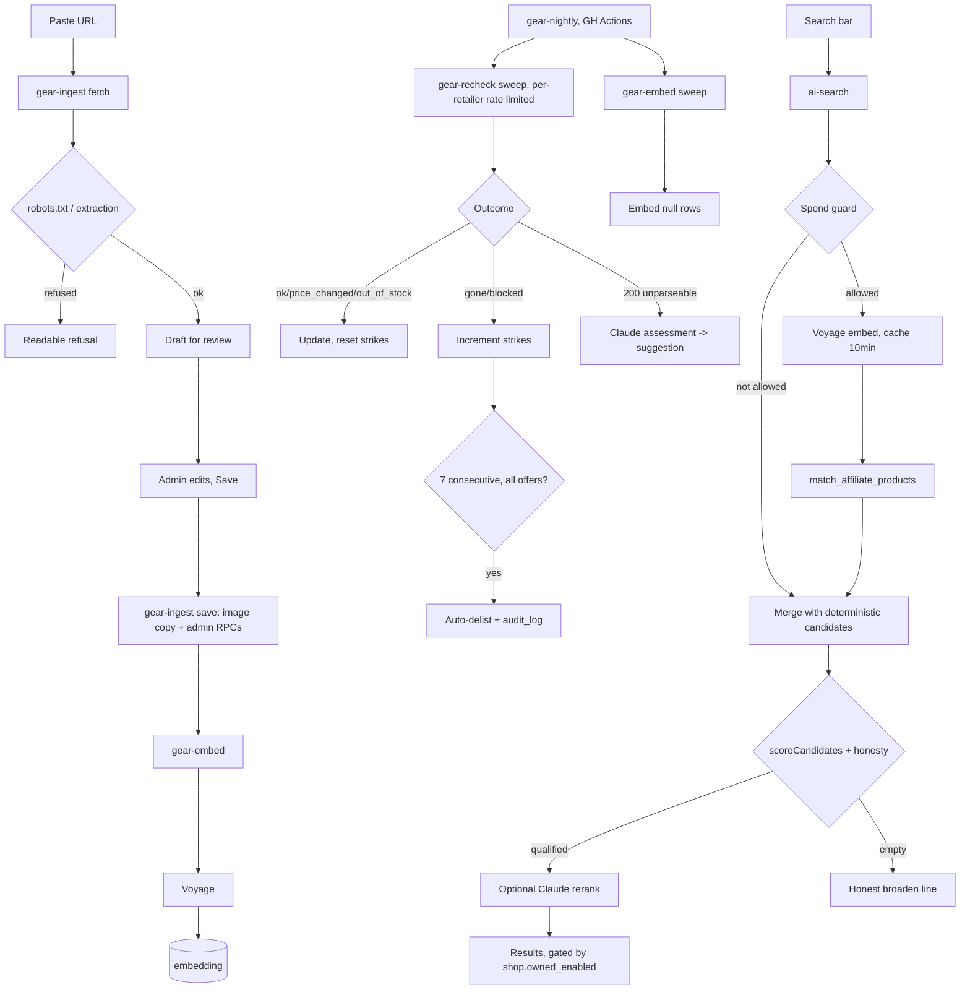

# ADR-011: Shop hybrid search, URL ingest, and catalogue health

Status: Proposed (blocked on founder answers to Open questions 11-13; everything else is
implementable today, no new vendor, no new database).

Date: 2026-09-17. Relates to PRD-07-shopper.md section 11 (FR-40 to FR-53), migrations `0086`
and `0120`, `supabase/functions/ai-search/*`.

## Context and Problem Statement

The affiliate catalog (`affiliate_products`/`product_offers`, 0086) has 8 products, 17 offers,
entered by hand via 0120's admin RPCs. `ai-search` already ranks it with a deterministic
keyword score, an optional Claude rerank behind a spend guard, and an honesty threshold
(FR-16/FR-42). To become the primary shop before store submission (26 Sep), it needs: a search
that understands a query with no brand or category keyword in it ("light racket for a 12 year
old"), a way to grow the catalogue from a pasted retailer link in under a minute, and a standing
check that a listed product is still real.

pgvector is available but not installed; the founder has locked the vector choice to pgvector
plus Voyage, no new database. `pg_net` is OFF in production (verified read-only 2026-08-14,
`supabase/deploy/README.md`), so `pg_cron` cannot call an edge function alone; the repo already
has one written-but-unscheduled job (`notification_push_sweep_schedule.sql`) blocked on exactly
this. Any nightly automation here must either work without `pg_net` today, or wait behind that
same gap.

## Decision Drivers

- Ship by 26 September.
- No new database or vector/search vendor (pgvector + Voyage is closed, not reopened here).
- `pg_net` is off in production; a design that assumes it is on ships broken.
- Reuse existing shapes: spend guard, `audit_log`, `has_role('admin')` SECURITY DEFINER RPCs.
- CLAUDE.md: RLS is a floor not scoping; clients never write catalogue truth directly.
- Catalogue is small at launch (hundreds of rows); a real job queue is over-engineering today.

## Considered Options

1. **pgvector + Voyage hybrid inside `ai-search`, an in-house `gear-ingest` function, nightly
   health via GitHub Actions.** (chosen)
2. **Do nothing further**: keyword-only search, 0120 manual entry only, no health sweep.
3. **Managed third-party search/vector service** (Algolia/Typesense/Pinecone) plus a hosted
   scraping service (Browserless/ScrapingBee).
4. **Client-side embedding and search** inside the Expo app.

## Decision Outcome

Chosen: **1**. Each decision below names its own alternatives and Confirmation; all are
collected in the top-level Confirmation section.

### D1. Hybrid ranking in `ai-search`

New SQL function does vector recall; the deterministic path stays baseline:

```sql
create or replace function public.match_affiliate_products(
  query_embedding vector(1024), match_threshold float, match_count int
) returns table(id uuid, similarity float) language sql stable as $$
  select id, 1 - (embedding <=> query_embedding) as similarity
  from public.affiliate_products
  where active and embedding is not null
    and 1 - (embedding <=> query_embedding) >= match_threshold
  order by embedding <=> query_embedding limit match_count;
$$;  -- backed by an HNSW index on embedding, vector_cosine_ops
```

Called at `match_threshold = VECTOR_SIMILARITY_FLOOR` (0.38, calibrated 2026-09-19 against voyage-3 on the production catalogue; the 0.75 first chosen was never cleared by a real query; see search-core.ts) beside the existing
`CONFIDENCE_FLOOR`); results hydrate through `fetchAffiliateProducts` and fold into the same
candidate array `scoreCandidates` scores today, only ADDING candidates the keyword path missed,
never re-weighting the score. `passesHardConstraints` gains one more way to satisfy the
keyword-relevance floor: a candidate whose similarity clears the floor counts as relevant with
zero keyword hits (AC-11-2, no brand in the query). Brand/price hard constraints are untouched.

The query embedding is computed inside `ai-search` itself via the Voyage API, cached by
`sha256(lower(trim(query)))` for 10 minutes in a new service-role-only table
(`query_embedding_cache`). `evaluateAiSearchGate` is extended to gate the Voyage call with the
same per-user throttle and daily budget it gates Claude with; `recordAiSpend` records Voyage
cost into the same `ai_spend_daily` ledger. Over budget, `ai-search` skips Voyage, returns
deterministic-only results, never an error.

Alternatives: embedding the query client side puts `VOYAGE_API_KEY` on the client and bypasses
the spend guard, rejected. A separate `gear-search-embed` function is an extra hop and secret
for no behavioural gain, rejected.

**Confirmation**: `scripts/verify-search-hybrid.mjs` (new): "light racket for a 12 year old
starting badminton" returns a beginner/junior badminton racket in the top 3 (AC-11-2); a vector
match priced above every ceiling still returns the honest broaden line (FR-42 regression); with
`ai_spend_daily` forced over budget, the same query returns `mode: "keyword"`, zero Voyage calls.

### D2. Embedding lifecycle: `gear-embed`

New function, two calls: `{productId}` (one row) and `{sweep:true, limit}` (rows where
`embedding is null`). Called by the admin app right after `admin_upsert_affiliate_product`
(FR-43), and by the nightly sweep as backfill. No `embedding_pending` column: pending state IS
`embedding IS NULL`, one source of truth. Writes only under service role (FR-43, AC-11-7); the
function requires a service-role key or an admin JWT, anon always refused. On Voyage failure,
`embedding` stays null, failure logs to Sentry; the product still appears via the keyword path
(FR-43's own proof). The nightly backfill uses the D4 trigger, not `pg_cron` directly.

Alternatives: an `embedding_pending` flag driven by `pg_cron`+`pg_net`, rejected only because
`pg_net` is off today (better once enabled, see D4). A dedicated `embedding_jobs` queue table is
unneeded for one provider and a hundreds-of-rows catalogue; `embedding IS NULL` is the queue.

**Confirmation**: `scripts/verify-gear-embed.mjs` (new): create a product, call `gear-embed`,
assert `embedding is not null`; re-run with a bad `VOYAGE_API_KEY`, assert `embedding` stays
null AND the product still surfaces via a deterministic `ai-search` query for its title.

### D3. Ingest: `gear-ingest`

Fetch policy: named UA (`AtlitosBot/1.0 (+https://atlitos.com/bot)`), 10s timeout, 5MB size cap,
`robots.txt` check before the product fetch; a disallow is FR-47's refusal, no page fetch.

Extraction order, first hit wins: JSON-LD `Product` schema, then Open Graph tags, then
`retailer_programmes.extractor` for the retailer the URL's hostname matches in `url_patterns`.
No match is FR-47's refusal; the manual form stays usable underneath.

Two actions, **nothing written on `fetch`** (FR-44), not even the image copy; `fetch` returns
only `source_image_url` for preview. `save` fetches + hashes (SHA-256) + copies the image to
`product-images/<retailer_key>/<hash>.<ext>` (skip if that path exists, the dedupe), then calls
`admin_upsert_affiliate_product` and `admin_upsert_product_offer` (both extended) **using the
admin's own forwarded JWT, not service role**, so `has_role('admin')` inside those RPCs stays
the single place deciding who may write the catalogue. Service role in `gear-ingest` is used
only for the outbound retailer fetch and the Storage write, never the catalogue DB write.

Two existing RPCs gain trailing, defaulted, backward-compatible parameters rather than new
RPCs, matching 0120's one-RPC-per-entity convention:

- `admin_upsert_affiliate_product(..., p_image_path text default null, p_source_image_url text default null)`
- `admin_upsert_product_offer(..., p_canonical_url text default null, p_retailer_key text default null)`

Manual entry never passes the new parameters; its call sites are unchanged.

Alternatives: separate ingest-only RPCs would let manual and ingest validation drift apart, the
bug class CLAUDE.md's "sweep for the class" warns about, rejected. Copying the image during
`fetch` contradicts FR-44 and leaves orphaned Storage objects for abandoned previews, rejected.

**Confirmation**: `scripts/verify-gear-ingest.mjs` (new), against a local fixture page (never a
live retailer): `fetch` leaves row counts unchanged; `save` creates exactly one row in each
table and `image_url` resolves to the project's Storage domain, never the fixture's host
(AC-11-3, on a controlled fixture).

### D4. Health: `gear-recheck`

Trigger, given `pg_net` is off: `pg_cron`+`pg_net` is blocked today, the exact gap
`notification_push_sweep_schedule.sql` lives in; Vercel cron is a new deployment target for a
job that already has a working host (GitHub, where CI runs); a scheduled GitHub Actions
workflow curling the function with a service-role repo secret works today, no new vendor.
Chosen: **GitHub Actions**. New `.github/workflows/gear-nightly.yml` curls `gear-recheck`
(`{sweep:true}`) and `gear-embed` (`{sweep:true, limit:200}`) nightly. Explicitly interim: once
`pg_net` is enabled, this moves into `supabase/deploy/gear_nightly_schedule.sql` following the
exact guarded template `notification_push_sweep_schedule.sql` sets, workflow deleted. Record as
an owned item in `docs/DEBT.md`, same shape as the existing push-sweep gap.

`gear-recheck` groups offers by `retailer_key`, reads `retailer_programmes.fetch_policy`
(`{maxPerMinute}`) to space requests, caps work per invocation. Outcome enum, on
`product_offers.last_check_outcome` and appended to `product_fetch_log`:
`ok | price_changed | out_of_stock | gone | blocked`. Only `gone`/`blocked` increment
`consecutive_failures`; the rest reset it to 0 (an out-of-stock page is a successful fetch, not
a failure). When every offer on a product hits `consecutive_failures >= 7`, `gear-recheck` calls
a new SECURITY DEFINER RPC, `system_auto_delist_affiliate_product(p_id, p_reason)`,
`service_role`-only, setting `active=false`, `auto_delisted_at=now()`, and writing one
`audit_log` row with `actor_id=null` and the reason.

FR-52's AI assessment runs only on a 200 that no extraction strategy parses, never on a clean
`gone`/`blocked`. It reuses the Claude client and the SAME `ai_spend_daily` ledger D1 uses; over
budget the assessment is skipped, the sweep is never blocked. Result goes to
`product_fetch_log.ai_suggestion` (jsonb), never applied automatically.

Alternative: treating `out_of_stock` as a strike would auto-delist a popular sold-out item
inside a week for being successful, rejected.

**Confirmation**: `scripts/verify-gear-health.mjs` (new): seed one offer, drive
`consecutive_failures` to 6 via six simulated `gone` outcomes, run `gear-recheck` once more,
assert `active=false` and one `audit_log` row with `actor_id is null` exists (AC-11-4: "test
with the counter set to 6"). SQL invariant for `scripts/security-invariants.sh`: every
`audit_log` row whose `action` starts with `affiliate_product.auto` has `actor_id is null`.

### D5. Owned shop flag

New table, seeded `key='shop.owned_enabled'`, `enabled=false`, `public=true`:

```sql
create table public.app_config (
  key text primary key, value jsonb not null, public boolean not null default false, updated_at timestamptz
);
```

RLS: `for select to anon, authenticated using (public = true)`, same shape as `promo_banners`.
Write only via new audited `admin_set_app_config(p_key, p_value jsonb)`; read of public rows via
`get_app_config(p_key)`. (Built as a generic key/value in Phase S1 so a second flag needs no
schema change; the ADR originally said `enabled boolean`.)

Alternatives: `EXPO_PUBLIC_SHOP_OWNED_ENABLED` is inlined at Expo BUILD time, flipping it needs
a rebuild and store resubmission, contradicting FR-53's "a config change, not a deploy,"
rejected. A Vault entry has no PostgREST-exposed read for anon/authenticated (it is for
secrets), and this flag must be readable by the mobile client, rejected. A jsonb `value` column
is unneeded generality for one flag, rejected.

Enforcement is server side: `checkout` reads `app_config` (service role) first and refuses
`{error:"SHOP_DISABLED"}` before any pricing/stock logic if `enabled=false` (AC-11-5), so a
stale client cannot buy while off. `ai-search` reads the same row and skips `fetchProducts`
(owned) when disabled. Mobile hides `/shop/cart`/`checkout*`/`order*` and owned cards for the
same reason, defense in depth; the boundary is `checkout`'s own check.

**Confirmation**: `scripts/verify-owned-shop-flag.mjs` (new): set flag false, POST to
`checkout` with an owned-item payload, assert `SHOP_DISABLED` and no `orders`/`payment_intents`
row created; query `ai-search` broadly, assert zero results lacking the `affiliate:` prefix.

### D6. RLS and grants

No table here is user-owned or per-user scoped; every one is system-owned reference or
operational data, the class `promo_banners` already is.

- `affiliate_products.embedding`: excluded from every client select via a **column-level
  grant** naming every column except `embedding`, not a table-level grant. A separate
  `affiliate_products_public` view is one more object to keep in sync with every future column,
  rejected; relying on client discipline is rejected outright, the floor posture applies to
  reads exactly as it applies to money writes.
- `product_fetch_log`: `for select to authenticated using (has_role('admin'))`, no anon policy,
  no write grant to anon/authenticated; only `gear-recheck`'s service-role client writes it.
- `retailer_programmes`: admin-read only, deliberately NOT public-browse like
  `affiliate_products`: operational config, not shopper content.
- `query_embedding_cache`: no anon/authenticated grant at all (service role only).

**Confirmation**: `scripts/verify-gear-search-rls.mjs` (new): as anon, `select embedding from
affiliate_products limit 1` is refused (42501); `select * from product_fetch_log` and
`retailer_programmes` return zero rows; curling `gear-ingest`/`gear-recheck` with the anon key
returns 401/403 for both (AC-11-6). SQL invariant in `scripts/security-invariants.sh`, run in
CI's non-offline `db-migrations` job:

```sql
select count(*) from information_schema.column_privileges
 where table_name = 'affiliate_products' and column_name = 'embedding'
   and grantee in ('anon','authenticated');   -- must be 0
```

### D7. Migration numbering

Per `docs/BRANCHING.md` rule 4, files are `XXXX_<name>.sql` while the branch lives, renumbered
at merge. Highest number in `supabase/migrations/` today is `0120`. One file per concern,
matching the `0070_product_media_bucket.sql` precedent:

| Provisional file | Contents |
|---|---|
| `0121_gear_search_vectors.sql` | `vector` extension, `embedding` column, HNSW index, `match_affiliate_products`, `query_embedding_cache` + RLS |
| `0124_product_images_bucket.sql` | `product-images` bucket, public read, service-role write only |
| `0123_gear_ingest_health.sql` | `retailer_programmes`, `product_fetch_log`, `product_offers` new columns, `system_auto_delist_affiliate_product`, extended admin RPCs, column-level grant |
| `0122_app_config_owned_shop_flag.sql` | `app_config` + RLS, `admin_set_app_config`, seed row |

## Consequences

Good: reuses trusted patterns (spend guard, `audit_log`, admin RPC shape, public-browse RLS);
no new vendor or database; a Voyage/Claude outage degrades every path to its
deterministic/mechanical fallback, never a 500; the query cache bounds Voyage cost at 10,000
users the way the existing ledger already bounds Claude cost.

Bad: GitHub Actions is not a Supabase-native scheduler; a forgotten secret or an outage silently
starves the sweep the way an un-run push-sweep already starves notifications in production,
needs a `docs/DEBT.md` entry and a backlog query. Column-level grants are easy to widen back
accidentally later, why D6's check is a standing CI invariant, not a one-time proof.
`VECTOR_SIMILARITY_FLOOR`/`CONFIDENCE_FLOOR` can drift out of sync if tuned separately.
Retailer-side scraping is fragile to markup changes and carries an unresolved ToS question
(Open question 12); copying a retailer's image carries an unresolved rights question (13).

## Confirmation

1. `scripts/verify-search-hybrid.mjs` — D1, AC-11-1, AC-11-2, FR-42 regression.
2. `scripts/verify-gear-embed.mjs` — D2, FR-43, AC-11-7.
3. `scripts/verify-gear-ingest.mjs` — D3, AC-11-3 (controlled fixture, not a live retailer).
4. `scripts/verify-gear-health.mjs` — D4, AC-11-4.
5. `scripts/verify-owned-shop-flag.mjs` — D5, AC-11-5.
6. `scripts/verify-gear-search-rls.mjs` — D6, AC-11-6, plus the SQL invariant in
   `scripts/security-invariants.sh`.
7. `supabase start` + CI's `db-migrations` job — D7, proves the four migrations replay clean.

None exist yet; each is the check its own decision must be proven against before merge, born
red: plant the violation, watch it fail, then make it pass.

## Pros and Cons of the Options

| Option | Good | Bad |
|---|---|---|
| **1 (chosen)**: pgvector+Voyage, in-house ingest, GH Actions sweep | No new vendor/database; every write path reuses an existing authorization shape | GH Actions is a second, interim scheduler alongside `pg_cron`; retailer fetching is fragile, ToS unresolved |
| **2**: Do nothing further | Zero new code or risk | Cannot meet FR-40/44/48; no path for a no-brand/keyword query (AC-11-2); an unchecked catalogue rots silently. Honest fallback if D1-D4 slip past 26 Sep |
| **3**: Managed third-party search + hosted scraping | Offloads infra to a vendor SLA | Contradicts "no new database"; a dependency to keep alive; moves spend guard's job onto an unfamiliar pricing model |
| **4**: Client-side embedding/search | — | Catalogue with live prices would ship in-bundle, defeating FR-41; no server-authoritative point for FR-42's honesty threshold |

## Component design

### Component boundaries

| Component | Owns |
|---|---|
| `ai-search/` (extended) | Query-time ranking; gains a Voyage call and `match_affiliate_products` read. `search-core.ts` stays pure, gains `VECTOR_SIMILARITY_FLOOR` and a similarity input to `passesHardConstraints`. |
| `gear-ingest/` (new) | URL to reviewable draft; on save, image copy plus the two extended admin RPC calls. Never touches ranking or health. |
| `gear-embed/` (new) | The one write path to `embedding`. Called by the admin app post-save and the nightly sweep; never by `ai-search`. |
| `gear-recheck/` (new) | Offer health, outcome enum, strikes, delist. Never writes `embedding`. |
| `apps/admin/.../gear/` (extended) | Paste-URL flow, Catalog health page; writes only through admin RPCs. |
| `apps/mobile/.../shop/` (extended) | Search bar becomes shop home; routing and flag-gating only. |

### Data model deltas and the security boundary

No table introduced is user-owned; every one is system-owned reference or operational data, the
`promo_banners` class (policies re-derive their own filter rather than trust a join, per
CLAUDE.md's permissive-OR warning).

| Table | New columns | Read | Write |
|---|---|---|---|
| `affiliate_products` | `embedding vector(1024)`, `source_image_url`, `image_path` | public (`active`) minus `embedding`; admin all | `admin_upsert_affiliate_product` (admin JWT); `embedding` only via `gear-embed` (service role) |
| `product_offers` | `canonical_url`, `retailer_key`, `last_check_outcome`, `consecutive_failures`, `last_price_change_at` | public (product active); admin all | `admin_upsert_product_offer` (admin JWT); outcome/strike cols via `gear-recheck` (service role) |
| `retailer_programmes` (new) | key, display_name, url_patterns, affiliate_tag_template, fetch_policy, extractor | admin only | service role / seed migration, no RPC yet |
| `product_fetch_log` (new) | offer_id, fetched_at, outcome, http_status, price_seen, in_stock_seen, notes, ai_suggestion | admin only | `gear-recheck` (service role) only |
| `query_embedding_cache` (new) | query_hash, embedding, created_at | none (service role only) | `ai-search` (service role) only |
| `app_config` (new) | key, enabled, public | public where `public=true` | `admin_set_app_config` (admin JWT) |

### Interface signatures crossing a component boundary

```ts
// ai-search/search-core.ts (pure, extended)
export const VECTOR_SIMILARITY_FLOOR = 0.38; // calibrated 2026-09-19, see search-core.ts
export function passesHardConstraints(c: Candidate, intent: ParsedIntent, vectorSimilarity?: number): boolean;
// gear-ingest, admin JWT only
POST /gear-ingest { action: "fetch"; url: string }
  -> 200 { draft: { title, brand, price, currency, inStock, imageUrl, canonicalUrl, retailerKey,
           confidence: Record<string,"high"|"low"> } }
  -> 422 { error: "UNSUPPORTED_RETAILER" | "ROBOTS_DISALLOWED" | "NO_PRODUCT_FOUND" }
POST /gear-ingest { action: "save"; draft: {...edited}; productId?: string }
  -> 200 { product: AffiliateProductRow; offer: ProductOfferRow }
// gear-embed, admin JWT or service role
POST /gear-embed { productId: string } | { sweep: true; limit: number }
  -> 200 { embedded: number; failed: number }
// gear-recheck, service-role (sweep) or admin JWT (single product, FR-50 "Re-check now")
POST /gear-recheck { sweep: true } | { productId: string }
  -> 200 { checked: number; outcomes: Record<OfferOutcome, number>; autoDelisted: string[] }
// admin RPCs, extended (trailing, defaulted, backward compatible)
admin_upsert_affiliate_product(..., p_image_path text default null, p_source_image_url text default null)
admin_upsert_product_offer(..., p_canonical_url text default null, p_retailer_key text default null)
system_auto_delist_affiliate_product(p_id uuid, p_reason text)  -- service_role execute only
admin_set_app_config(p_key text, p_value jsonb)                 -- admin JWT
```

`ai-search`'s external contract is unchanged: same request/response shape, `mode` still
`"llm" | "keyword"`; vector recall is an internal detail, not a new field.

### Failure modes

| Failure | Behaviour |
|---|---|
| Voyage unreachable (query or product embedding) | vector recall skipped / `embedding` stays null; keyword path still serves the product (FR-43), never an error |
| Claude unreachable (rerank or FR-52) | rerank keeps deterministic order; assessment skipped that night |
| Over daily AI spend budget | Voyage + Claude both skipped rest of day, deterministic-only |
| Retailer blocks fetch / robots disallows | ingest: readable refusal; recheck: `blocked`, counts toward 7-strike |
| Retailer redesign breaks extraction | ingest: `NO_PRODUCT_FOUND`, manual form usable; recheck: FR-52 assessment stored as suggestion |
| GitHub Actions runner outage | next run's age-based due-list is larger; self-heals |
| Migration widens `affiliate_products` grants | caught by the standing SQL invariant, not by production |
| HNSW index missing/not built | `match_affiliate_products` still correct via seq scan, slower not wrong |

### Non-goals

- Commission attribution/ledger (PRD-07 10.4 stands); official retailer APIs before approval;
  price history charts or alerts; vector search over the OWNED catalogue (FR-40 scopes this to
  `affiliate_products`); personalized or per-user ranking.
- Sub-nightly price freshness ("checked N hours ago" is honest, not real-time); a real job
  queue or worker fleet, the catalogue is sized in the hundreds, not thousands.

## Data flow



## New secrets

`VOYAGE_API_KEY` (Supabase Edge Function secrets, read by `ai-search` and `gear-embed`);
`GEAR_NIGHTLY_SUPABASE_URL` and `GEAR_NIGHTLY_SERVICE_ROLE_KEY` (GitHub Actions repository
secrets, used only by `gear-nightly.yml`). `ANTHROPIC_API_KEY` and `SENTRY_*` already exist and
are reused as-is.

## Open questions

11. Which affiliate programmes are approved today, and what are the tags? Until known,
    `affiliate_tag_template` stays empty and offers store the bare canonical URL.
12. Is server-side fetching of retailer pages acceptable for launch volume given each
    retailer's terms? This ADR implements the mechanism, not a ToS decision.
13. Image rights: is copying a retailer's image acceptable with take-down-on-request, or does
    it need per-retailer permission first? D3 works either way; the posture is a founder call.
14. Final Voyage model, `voyage-3` vs `voyage-3-lite`: both satisfy 1024 dims via
    `output_dimension`; this ADR defaults to `voyage-3-lite` for cost, reversible in one env
    value, not gated on this ADR.
